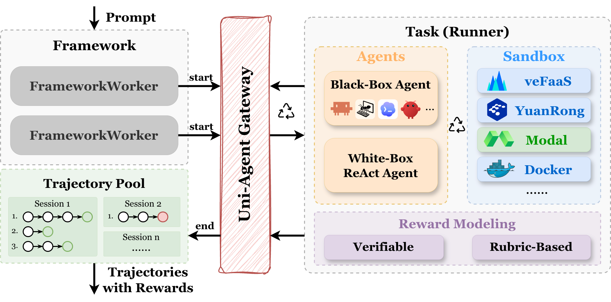

<h1>Uni-Agent: Train Long-Horizon Agents at Scale</h1>

<p>
  <a href="https://uni-agent.readthedocs.io/en/latest/index.html"></a>
  <a href="https://github.com/verl-project/uni-agent/stargazers"></a>
  <a href="./LICENSE"></a>
</p>

Uni-Agent is a framework for training long-horizon agents:

- Bring any existing agent harness into reinforcement learning.
- Unify diverse agent tasks through one extensible interface.
- Run agents concurrently at scale and collect traceable trajectories as training-ready data (SFT and RL).

<p>
  
</p>

## Highlights ✨

### Plug in any agent harness

Connect harnesses such as Claude Code and Mini-SWE-Agent, or any harness that can point its OpenAI- or Anthropic-compatible model endpoint at the **Uni-Agent Gateway**: request string in, training tokens out.

### Decouple agents, tasks, and infrastructure

Build white-box agents from reusable `Agent`, `Tool`, `Task`, and `Sandbox` abstractions. Customize agent logic, tools, task environments, sandbox backends, and rewards independently while reusing the same evaluation and training runtime.

### Run thousands of sessions concurrently

Run 1,000+ long-horizon, stateful sessions with distributed workers, pooled Gateway sessions, isolated sandboxes, and asynchronous scheduling. Every trajectory, log, and reward remains associated with the correct session for reliable evaluation, RL training, and data synthesis.

### Reproducible training, verifiable results

We publish runnable [recipes](./examples/) with complete configurations, benchmark settings, result tables, and learning curves. Each recipe provides a tested starting point and makes reported improvements easier to reproduce and verify.

## Quickstart 🚀

Follow the end-to-end path:

1. [Install Uni-Agent](https://uni-agent.readthedocs.io/en/latest/quickstart/installation.html)
2. [Launch a sandbox and run code](https://uni-agent.readthedocs.io/en/latest/quickstart/launch-sandbox.html)
3. [Run agent inference](https://uni-agent.readthedocs.io/en/latest/quickstart/agent-inference.html)
4. [Train an agent with RL](https://uni-agent.readthedocs.io/en/latest/quickstart/rl-training.html)

## Results 📊

### Parallel Inference & Verification

We compare Uni-Agent with existing agent systems on parallel inference and verification workloads.


| Model            | Benchmark          | OpenHands | Uni-Agent | Setting |
| ---------------- | ------------------ |:---------:|:---------:| ------- |
| Qwen3-Coder-30B  | SWE-Bench Verified | -         | **49.2**  | Avg@4, 100 turns, 128K |
| Qwen3-Coder-480B | SWE-Bench Verified | 62.4      | **64.2**  | Avg@4, 500 turns, 256K |
| Qwen3-Coder-Next | SWE-Bench Verified | 66.6      | **67.6**  | Avg@4, 300 turns, 128K |
| Qwen3.5-35B-A3B  | SWE-Bench Verified | 62.0      | **68.4**  | Avg@1, 200 turns, 128K |
| Qwen3.6-35B-A3B  | Terminal-Bench v2  | -         | **42.5**  | Avg@1, 200K |

Detailed settings and additional reference results are available in [Inference and Verification](https://uni-agent.readthedocs.io/en/latest/benchmark/inference.html).

### Agent Reinforcement Learning

Uni-Agent supports agent RL training with the same interaction stack used at inference time. We provide fully async training recipes across multiple tasks, models and datasets, with GRPO/GSPO-style objectives and partial rollout support.
Example scripts are available in [examples/agent_train](examples/agent_train).


| Model                        | Dataset      | Method | Setting | Base | RL |
| ---------------------------- | ------------ | ------ | ------- |:----:|:--:|
| Qwen3-30B-A3B-Instruct       | R2E-Gym      | GSPO   | Fully Async, 100 turns, 128K | 22.2 | **36.8** |
| Qwen3-Coder-30B-A3B-Instruct | R2E-Gym      | GSPO   | Fully Async, 100 turns, 128K | 46.2 | **52.0** |
| Qwen3.5-9B                   | SWE-reBench  | GRPO   | Fully Async, 100 turns, 128K | 53.8 | **59.2** |

Training dynamics, asynchronous rollout performance, and reproducibility details are available in [RL Training](https://uni-agent.readthedocs.io/en/latest/benchmark/rl-training.html).


## Roadmap 🗺️

See the [Uni-Agent 26Q3 Roadmap](https://github.com/verl-project/uni-agent/issues/79) for current priorities and planned work.

## Acknowledgement 🙏

Uni-Agent's large-scale parallel interaction and verification rely on remote sandbox backends. We gratefully acknowledge:

- **[veFaaS](https://www.volcengine.com/product/vefaas)**: Volcengine Function-as-a-Service, used as a serverless backend for elastically launching agent sandboxes at scale.
- **[Modal](https://modal.com)**: serverless cloud compute used to spin up isolated, reproducible sandbox environments for agent execution and evaluation.

## Citation 📚

If you find the project helpful, please cite:

```
@misc{uniagent_github,
  author       = {Yuyang Ding and Bo Wen and Xubo Cao and Zhiqiang Zhai and Guangming Sheng and Xibin Wu and Juntao Li and Min Zhang and Uni-Agent Contributors},
  title        = {Uni-Agent: Build, Run, and Train Agents at Scale},
  year         = {2026},
  howpublished = {\url{https://github.com/verl-project/uni-agent}},
  note         = {GitHub repository. Supervisor: Xibin Wu and Juntao Li},
  urldate      = {2026-03-27}
}
```

## Contributing 🤝

Community contributions are welcome. See [CONTRIBUTING.md](./CONTRIBUTING.md) for guidelines on how to get started.
